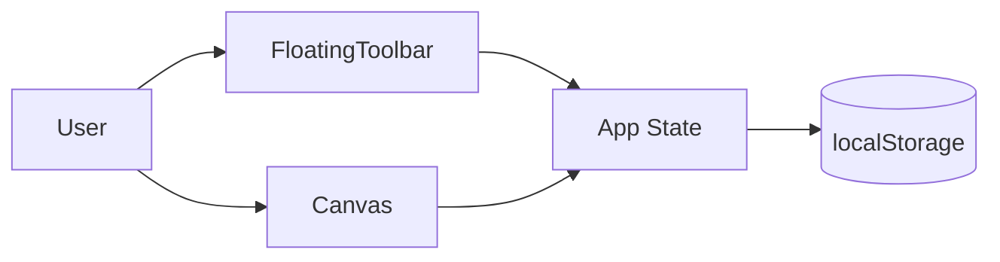
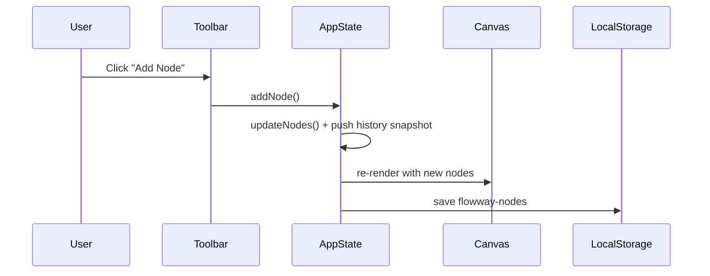
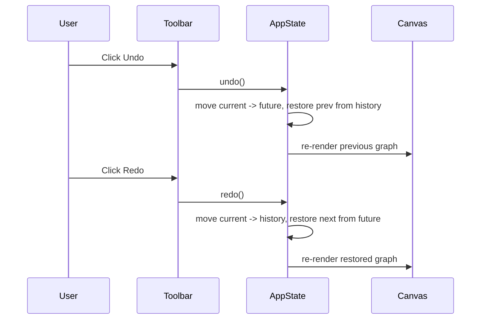

# Flowway

> **Flowway — a mind mapping tool for structured thinking.**

<p align="center">
  <a href="https://flowway-pi.vercel.app/"></a>
  
  
  
  
  
</p>

<p align="center">
  <a href="https://flowway-pi.vercel.app/">Demo</a> •
  <a href="https://github.com/RishavJbn/flowway/issues">Report Bug</a> •
  <a href="https://github.com/RishavJbn/flowway/issues">Request Feature</a>
</p>

---

## Table of Contents

- [About the Project](#about-the-project)
- [Tech Stack](#tech-stack)
- [Prerequisites](#prerequisites)
- [Local Installation (Step-by-Step)](#local-installation-step-by-step)
- [Project Structure](#project-structure)
- [Core Logic / How It Works](#core-logic--how-it-works)
- [API Documentation](#api-documentation)
- [Database Schema](#database-schema)
- [Environment Variables Reference](#environment-variables-reference)
- [Scripts Reference](#scripts-reference)
- [Testing](#testing)
- [Deployment](#deployment)
- [Folder-Level Configuration (Docker)](#folder-level-configuration-docker)
- [Contributing Guidelines](#contributing-guidelines)
- [Roadmap](#roadmap)
- [FAQ / Troubleshooting](#faq--troubleshooting)
- [License](#license)
- [Contact / Acknowledgements](#contact--acknowledgements)

---

## About the Project

Flowway is a visual mind-mapping app for turning ideas into structured node graphs.  
It helps users brainstorm, connect related thoughts, and iterate quickly on concept maps.

### Key Features

- Interactive node-based canvas powered by React Flow
- Create and connect idea nodes
- Node selection support
- Canvas theming and pattern options
- Undo/redo history state
- Local persistence using browser `localStorage` (nodes + edges)

### UI Preview

- Add screenshots/GIFs here:
  - `docs/screenshots/canvas.png`
  - `docs/screenshots/toolbar.png`
  - `docs/gifs/flowway-demo.gif`

### High-level Architecture



---

## Tech Stack

| Category | Technology | Purpose |
|---|---|---|
| Frontend Framework | React 19 | UI rendering and state-driven interactions |
| Build Tool | Vite 7 | Dev server and production build |
| Canvas/Graph Engine | React Flow (`reactflow`) | Node-edge diagram rendering and interactions |
| Styling | Tailwind CSS 4 + CSS | Utility-first styling and component polish |
| Icons | lucide-react | Toolbar and action icons |
| Linting | ESLint 9 | Code quality and consistency |

---

## Prerequisites

| Tool | Version |
|---|---|
| Node.js | **>= 18** (recommended LTS) |
| npm | Comes with Node.js |
| Git | Latest stable |

No external API keys, backend services, or DB accounts are currently required for local development.

---

## Local Installation (Step-by-Step)

> This project is frontend-only and currently lives under `client/`.

### 1) Clone the repository

```bash
git clone https://github.com/RishavJbn/flowway.git
cd flowway
```

### 2) Install dependencies

```bash
cd client
npm install
```

### 3) Environment setup

No `.env.example` file is present and no runtime env vars are currently required.

If you plan to add env vars later, create `client/.env` and document them in the section below.

### 4) Run in development mode

```bash
npm run dev
```

### 5) Build for production

```bash
npm run build
```

### 6) Preview production build locally

```bash
npm run preview
```

### 7) Run tests

No test script is currently defined in `client/package.json`.

### Default local URL/port

Vite default:
- `http://localhost:5173`

### Troubleshooting

<details>
<summary><strong>Port 5173 already in use</strong></summary>

Run Vite on a different port:

```bash
npm run dev -- --port 5174
```
</details>

<details>
<summary><strong>Dependencies fail to install</strong></summary>

Try:

```bash
rm -rf node_modules package-lock.json
npm install
```
</details>

<details>
<summary><strong>Blank screen after start</strong></summary>

Check browser console for runtime errors and ensure `client/src/main.jsx` still mounts `<App />` into `#root`.
</details>

---

## Project Structure

```text
flowway/
├─ README.md
└─ client/
   ├─ package.json
   ├─ package-lock.json
   ├─ vite.config.js
   ├─ eslint.config.js
   ├─ index.html
   ├─ README.md
   ├─ public/
   └─ src/
      ├─ main.jsx
      ├─ App.jsx
      ├─ App.css
      ├─ index.css
      ├─ assets/
      ├─ components/
      └─ utils/
```

### What each major part does

- `client/src/main.jsx` — React app bootstrap and root render.
- `client/src/App.jsx` — central state + orchestration of toolbar/canvas/features.
- `client/src/components/` — reusable UI/graph interaction components.
- `client/src/utils/` — utility helpers (if/when added).
- `client/vite.config.js` — Vite + plugin configuration.
- `client/eslint.config.js` — linting rules and standards.

---

## Core Logic / How It Works

At runtime, `App.jsx` owns the primary graph state: `nodes`, `edges`, selection info, canvas preferences, and history stacks.  
On first load, it hydrates graph data from `localStorage`; if none exists, a default starter node is created.

### Main data flow

1. App initializes `nodes` and `edges` from `localStorage`.
2. UI actions (toolbar/canvas interactions) trigger state updates.
3. Update wrappers (`updateNodes`, `updateEdges`) snapshot current state for undo/redo.
4. State is persisted back to `localStorage` through `useEffect`.
5. Canvas reflects latest state via props.

### Key design decisions

- **Lifted state in `App.jsx`**: keeps graph operations centralized and predictable.
- **Local persistence**: no backend dependency; fast startup and offline-friendly behavior.
- **History stacks (`history` + `future`)**: simple and understandable undo/redo model.

### Sequence Diagram: Node Add + Persist



### Sequence Diagram: Undo/Redo



---

## API Documentation

Not applicable right now.  
This repository currently contains a frontend-only React/Vite application with no backend API routes.

---

## Database Schema

Not applicable right now.  
No database integration is present; graph state is stored in browser `localStorage`.

---

## Environment Variables Reference

No environment variables are currently required.

| Variable | Description | Example | Required |
|---|---|---|---|
| _None_ | No runtime env vars detected in current source | — | — |

---

## Scripts Reference

From `client/package.json`:

| Script | Command | Description |
|---|---|---|
| `npm run dev` | `vite` | Starts local dev server |
| `npm run build` | `vite build` | Builds optimized production bundle |
| `npm run lint` | `eslint .` | Lints all project files |
| `npm run preview` | `vite preview` | Serves production build locally |

---

## Testing

No testing framework or test scripts are currently configured.

### Current status

- Unit tests: Not configured
- Integration tests: Not configured
- E2E tests: Not configured
- Coverage: Not configured

### Suggested future setup

- Unit/Component: Vitest + React Testing Library
- E2E: Playwright

---

## Deployment

Current live URL: **https://flowway-pi.vercel.app/**

### Vercel deployment (recommended)

1. Push latest code to GitHub.
2. Import `RishavJbn/flowway` into Vercel.
3. Set **Root Directory** to `client`.
4. Build command: `npm run build`
5. Output directory: `dist`
6. Deploy.

### Production env vars

None currently required.

### CI/CD

No CI workflow is currently defined in the inspected files.  
If you add GitHub Actions later, document workflow paths under `.github/workflows/`.

---

## Folder-Level Configuration (Docker)

Docker configuration is not currently present (`Dockerfile`/`docker-compose.yml` not found).

If needed, add:
- `client/Dockerfile`
- `docker-compose.yml`

Then document build/run commands here.

---

## Contributing Guidelines

Contributions are welcome.

### Workflow

1. Fork the repository.
2. Create a feature branch:
   ```bash
   git checkout -b feat/your-feature-name
   ```
3. Commit using conventional-style messages:
   - `feat: add node color presets`
   - `fix: resolve edge reconnect bug`
   - `docs: improve setup instructions`
4. Push branch and open a Pull Request.

### Code quality

- Run lint before PR:
  ```bash
  cd client
  npm run lint
  ```

No `CONTRIBUTING.md` file is currently present in the repository root.

---

## Roadmap

- [x] Interactive node canvas
- [x] Local persistence for graph state
- [x] Undo/redo
- [ ] Export/import mind maps (JSON)
- [ ] Keyboard shortcuts (add/delete/duplicate nodes)
- [ ] Auto-layout options
- [ ] Mini-map and advanced navigation
- [ ] Collaboration mode (multi-user)
- [ ] Backend sync and auth (optional)

---

## FAQ / Troubleshooting

<details>
<summary><strong>Where is the backend/API?</strong></summary>
This version is frontend-only. No backend service is currently included in the repository.
</details>

<details>
<summary><strong>Where is data stored?</strong></summary>
In browser `localStorage` under keys such as `flowway-nodes` and `flowway-edges`.
</details>

<details>
<summary><strong>Why is there no test command?</strong></summary>
Testing setup hasn’t been added yet. You can add Vitest/RTL and define a `test` script in `client/package.json`.
</details>

---

## License

This repository currently has **no license file configured** (`license: null` in repository metadata).

If you want open-source reuse, add a `LICENSE` file (e.g., MIT), then update this section.

---

## Contact / Acknowledgements

- **Maintainer:** [RishavJbn](https://github.com/RishavJbn)
- **Repository:** https://github.com/RishavJbn/flowway
- **Live Demo:** https://flowway-pi.vercel.app/

### Acknowledgements

- [React](https://react.dev/)
- [Vite](https://vite.dev/)
- [React Flow](https://reactflow.dev/)
- [Tailwind CSS](https://tailwindcss.com/)
- [Lucide](https://lucide.dev/)
